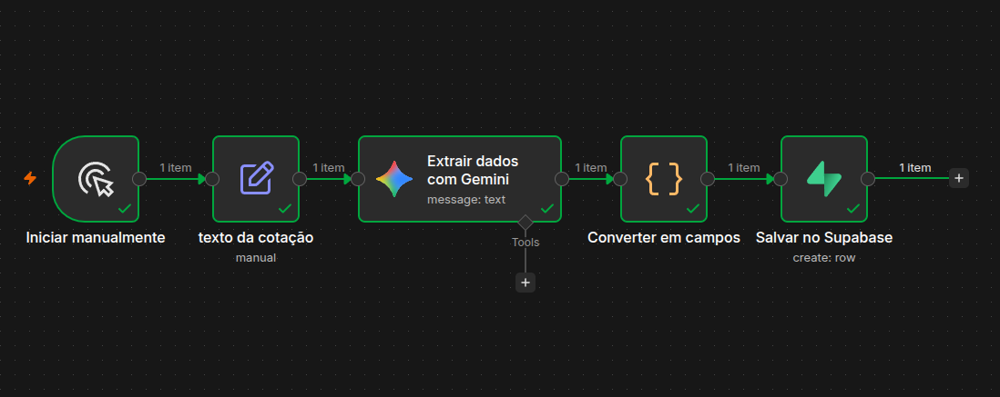
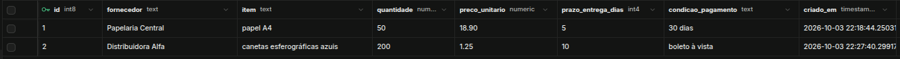

# Extrator de cotações

Automação em **n8n** que lê o texto de uma cotação de fornecedor, usa um **LLM (Gemini)** para extrair os dados principais e os salva numa tabela do **Supabase**, protegida com **Row Level Security (RLS)**.

Projeto de aprendizado construído do zero, sem experiência prévia com essas ferramentas.

## O problema

Em compras entre empresas, cada fornecedor responde uma cotação de um jeito: e-mail, mensagem, PDF, textos longos ou curtos. Comparar preços, prazos e condições manualmente dá trabalho e abre espaço para erros. Este projeto automatiza a primeira etapa: transformar o texto livre de uma cotação em dados organizados.

## Como funciona



1. **Iniciar manualmente:** o fluxo começa quando o usuário executa o workflow.
2. **Texto da cotação:** um nó guarda o texto da cotação no campo `texto_cotacao`.
3. **Extrair dados com Gemini:** o modelo recebe o texto e devolve um JSON com os campos pedidos no prompt.
4. **Converter em campos:** um nó de código (JavaScript) limpa a resposta e transforma o texto JSON em campos separados.
5. **Salvar no Supabase:** cada cotação vira uma linha na tabela `cotacoes`.

### Exemplo

Entrada:

> Prezados, para as 200 canetas esferográficas azuis conseguimos R$ 1,25 a unidade. Entregamos em até 10 dias e aceitamos boleto à vista. Abs, Distribuidora Alfa.

Resultado na tabela:

| fornecedor | item | quantidade | preco_unitario | prazo_entrega_dias | condicao_pagamento |
|---|---|---|---|---|---|
| Distribuidora Alfa | canetas esferográficas azuis | 200 | 1.25 | 10 | boleto à vista |



Textos de teste usados: [`exemplos/cotacoes_de_teste.txt`](exemplos/cotacoes_de_teste.txt).

## Tecnologias

- **n8n** (rodando localmente com Node.js 22): orquestração do fluxo.
- **Google Gemini** (API do Google AI Studio, plano gratuito): extração dos dados a partir do texto.
- **Supabase** (Postgres): armazenamento, com SQL, RLS e Data API.
- **JavaScript**: tratamento da resposta do modelo.
- **Git e GitHub**: versionamento.

## Estrutura do repositório

```
├── workflows/   fluxo do n8n exportado (.json)
├── sql/         script de criação da tabela e da política de acesso
├── exemplos/    textos de cotação usados nos testes
└── docs/        imagens usadas neste README
```

## Banco de dados e segurança

A tabela `cotacoes` é criada por [`sql/01_criar_tabela_cotacoes.sql`](sql/01_criar_tabela_cotacoes.sql). Decisões de acesso:

- **RLS ativado** na tabela: por padrão, nenhum usuário externo acessa as linhas.
- **Política de leitura** apenas para usuários autenticados.
- **A gravação é feita pelo n8n com a secret key do Supabase**, que é uma chave de servidor. Por isso ela fica guardada nas credenciais do n8n e **nunca** neste repositório.
- Nenhuma chave, token ou senha está versionada aqui.

## Como reproduzir

1. Instale o Node.js 22 (por exemplo, com o `nvm`) e inicie o n8n: `npx n8n`.
2. Crie um projeto no Supabase e execute o script `sql/01_criar_tabela_cotacoes.sql` no SQL Editor.
3. Gere uma chave de API do Gemini no Google AI Studio.
4. No n8n, importe `workflows/extrator-cotacoes.json`.
5. Crie as credenciais do **Google Gemini** (chave da API) e do **Supabase** (Project URL como Host e a secret key).
6. Execute o workflow e confira a nova linha na tabela `cotacoes`.

## Limitações conhecidas

- O gatilho é manual: o texto da cotação é colado no próprio fluxo.
- Se o modelo devolver algo fora do formato JSON pedido, o fluxo falha. Ainda não há validação nem tratamento de erro.
- Os dados de teste são inventados. No plano gratuito do Gemini, o conteúdo enviado pode ser usado pelo Google para melhorar seus produtos, então não use cotações reais de empresas.
- Cada execução cria uma linha nova, sem checar duplicatas.

## Próximos passos

- Receber as cotações por webhook ou por e-mail, em vez de texto fixo.
- Validar a resposta do modelo e tratar erros.
- Criar uma tela simples (por exemplo, no Lovable) para listar e comparar cotações.
- Extrair texto de cotações em PDF ou imagem (OCR).

## O que aprendi

> Revise esta seção e reescreva com suas palavras antes de publicar.

- Montar um fluxo de automação com nós e passar dados de um nó para o outro.
- Pedir ao LLM uma saída estruturada em JSON e tratar a resposta antes de usá-la.
- Modelar uma tabela em SQL e proteger o acesso com RLS.
- A diferença entre chaves públicas e chaves de servidor, e por que as segundas nunca vão para o repositório.
- Usar um assistente de IA para aprender as ferramentas e destravar erros ao longo da construção.

---

### Summary (English)

An n8n workflow that reads a supplier quote written in free text, uses Google Gemini to extract structured fields (supplier, item, quantity, unit price, delivery time, payment terms) and stores them in a Supabase table with Row Level Security enabled. Built as a learning project to practice workflow automation, LLM integration and SQL.
